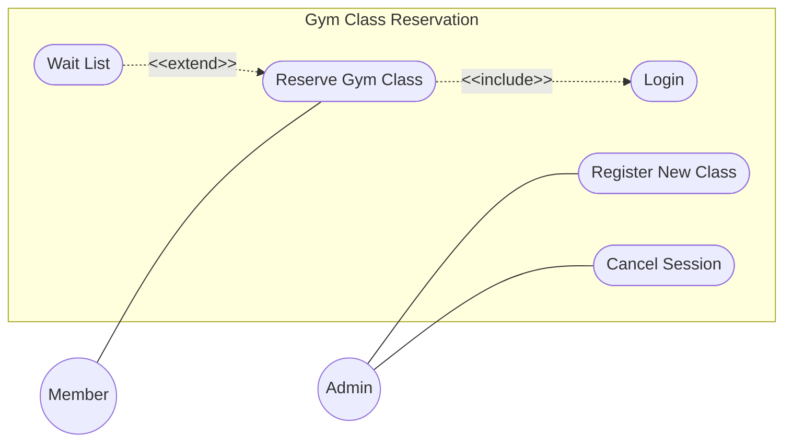

# Entornos-7.5

## Fase 1: Análisis de Requisitos

```mermaid
graph LR
%% Actores
Member((Member))
Admin((Admin))


%% Definir límite del Sistema y Acciones
subgraph "Gym Class Reservation"
CU1([Reserve Gym Class])
CU2([Login])
CU3([Wait List])
CU4([Register New Class])
CU5([Cancel Session])


%% Relaciones especiales (include y extend)
CU1 -.->|&lt;&lt;include&gt;&gt;| CU2
CU3 -.->|&lt;&lt;extend&gt;&gt;| CU1
end
%% Rrelaciones Actor y Casos de Uso
Member --- CU1
Admin --- CU4
Admin --- CU5
```
