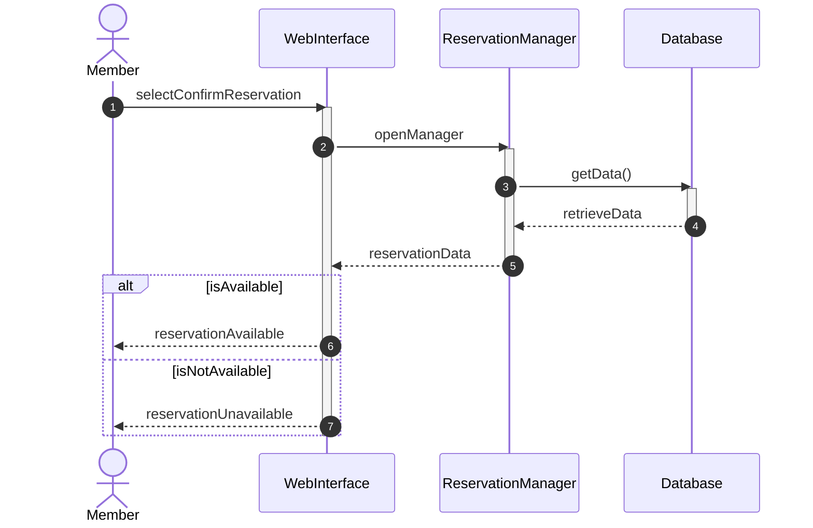
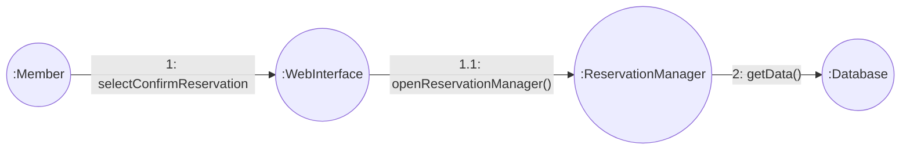
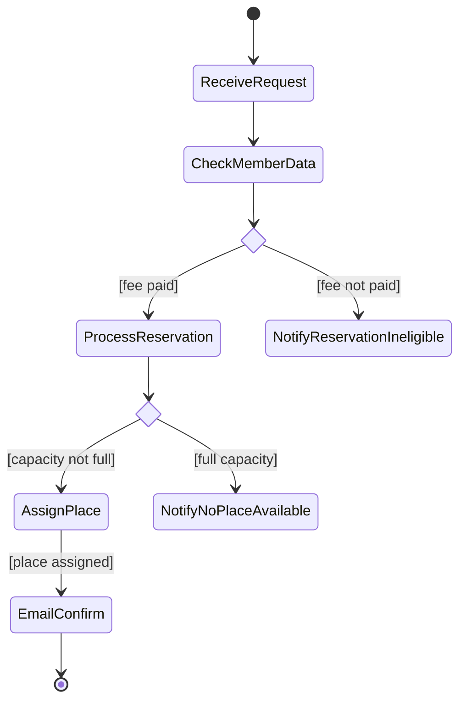

# Entornos-7.5

## Fase 1: Análisis de Requisitos


# Fase 2: Diseño de la Interacción
### Diagrama de Secuencia


### Diagrama de Comunicación


# Fase 3: Lógica del Proceso


## Fase 4: Ciclo de Vida del Objeto
``` mermaid
Diagrama de Estados
stateDiagram-v2
%% Draft: Está creada o creándose
[*] --> Draft
%%% Issued: Está creada y enviada
Draft --> Issued : send()
%% Confirmed: Está confirmada
Issued --> Confirmed : confirm()
%% Cancelled: Está cancelada
Issued --> Cancelled: cancel()
%% Realizada: Fue confirmada y el Socio se presentó
Confirmed --> CheckedIn: checkIn()
%% NotShownUp: Fue confirmada pero el Socio no se presentó
Confirmed --> NotShownUp: didNotShowUp()

%% Estados Finales
CheckedIn --> [*]
NotShownUp --> [*]
Cancelled --> [*]
```