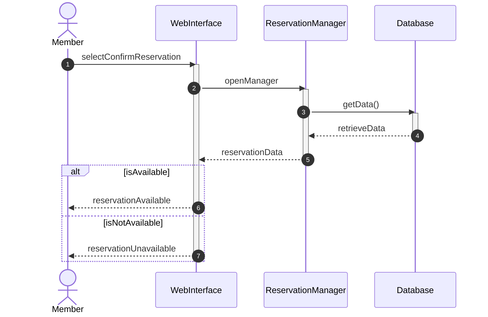
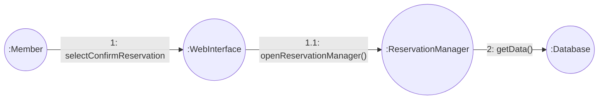

# Entornos-7.5

## Fase 1: Análisis de Requisitos

```mermaid
graph LR
%% Actores
Member((Member))
Admin((Admin))


%% Definir límite del Sistema y Acciones
subgraph "Gym Class Reservation"
CU1([Reserve Gym Class])
CU2([Login])
CU3([Wait List])
CU4([Register New Class])
CU5([Cancel Session])


%% Relaciones especiales (include y extend)
CU1 -.->|&lt;&lt;include&gt;&gt;| CU2
CU3 -.->|&lt;&lt;extend&gt;&gt;| CU1
end
%% Rrelaciones Actor y Casos de Uso
Member --- CU1
Admin --- CU4
Admin --- CU5
```

# Fase 2: Diseño de la Interacción
### Diagrama de Secuencia

``` mermaid
sequenceDiagram
%% Numerado automatico para mejor seguimiento
autonumber

%% Actores y Participantes
actor Member 
participant WebInterface
participant ReservationManager
participant Database

%% Definir flujo
Member->>WebInterface: selectConfirmReservation
activate WebInterface
WebInterface->>ReservationManager: openManager
activate ReservationManager
ReservationManager->>Database: getData()
activate Database
Database-->>ReservationManager: retrieveData
deactivate Database
ReservationManager-->>WebInterface: reservationData
deactivate ReservationManager

%% Condiciones según el resultado de buscar en la Base de Datos
alt isAvailable
WebInterface -->>Member: reservationAvailable
else isNotAvailable
WebInterface-->>Member: reservationUnavailable
end
deactivate WebInterface
```

Diagrama de Comunicación

``` mermaid
graph LR
Member((:Member))
%% El Socio hace la petición a la Web de Reservas
-- "1: selectConfirmReservation"
--> WebInterface((:WebInterface))
WebInterface
-- "1.1: openReservationManager()"
--> Manager((:ReservationManager))
Manager
-- "2: getData()"
--> Database((:Database))
```
